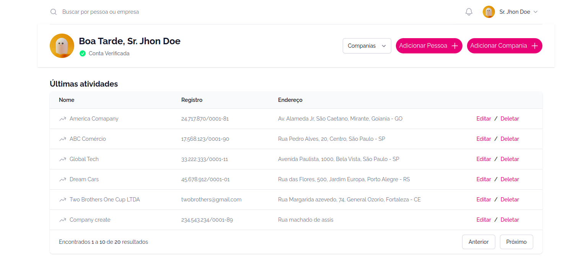
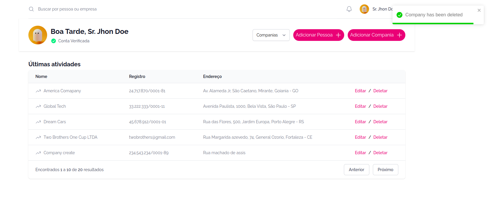
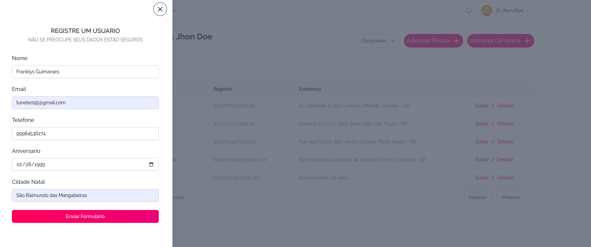

### People List Frontend




##### Project run : 

```yml
yarn && yarn dev
```

##### Run tests

```yml
yarn test
```

#### Obvious remarks:
- It's not mandatory, but it's interesting to have the backend running before running the frontend
- It is highly necessary that both the backend and the frontend are running!

##### A Tip
- To make it easier, I like to leave a project running in each terminal, so we have the free test editor

#### Conclusion: 
- The application was developed using NextJS with Tailwindcss for styling and animation
- The `react-toastfy` library was used to give the user responses, such as success and error
- The tests were done using the `cypress` library
- To make all the requests, we use the `axios` lib
- Finally, to manage the application of states, we use the `Context API` of `React` itself